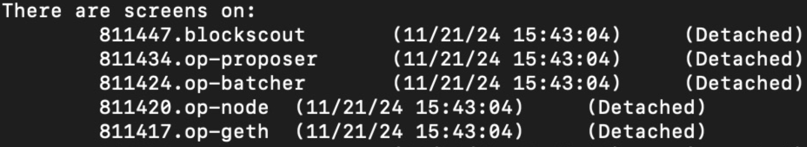

# opup, one-stop installation tool for OP Stack


# usage
```
# prerequisite
mkdir /root/da/data # or replace it with your dir 
export ES=true
```
To start all processes, just run `just up`.
> If you encountered errors with `founry` and `upgrade-semgrep`, please run:
> `cd optimism; just upgrade-semgrep ; just update-foundry`, then rerun `just up`
 
If anything goes wrong, it'll stop immediately, indicating the exact line that's triggering it.

If everything goes well, it'll spin up these processes:



(Each process is managed in a separate [screen](https://linuxize.com/post/how-to-use-linux-screen/) session.)

To shut down all processes, just run `just down`.
